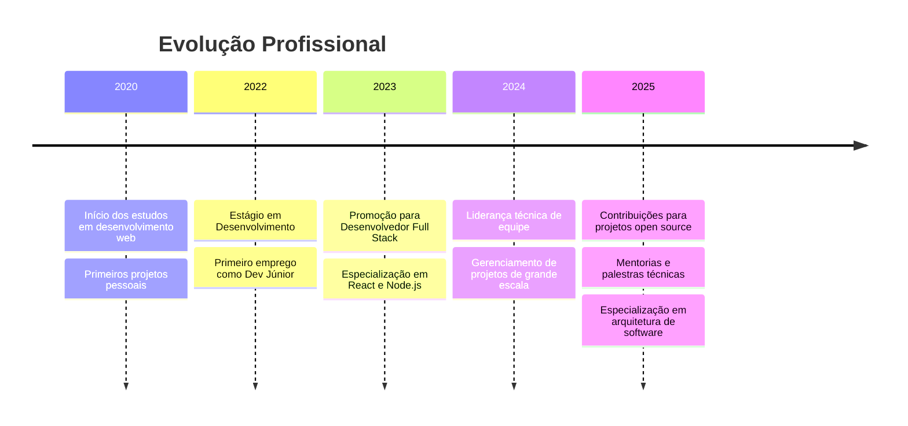

# 
👋 Olá, eu sou o Lucas Magista

  

<!-- Cabeçalho 3D -->
<picture>
  <source media="(prefers-color-scheme: dark)" srcset="https://capsule-render.vercel.app/api?type=waving&color=0:3a0ca3,100:4cc9f0&height=200&section=header&text=Lucas%20Magista&fontSize=70&fontColor=ffffff&animation=fadeIn&fontAlignY=38&desc=Desenvolvedor%20Full%20Stack&descAlignY=60&descSize=22">
  <source media="(prefers-color-scheme: light)" srcset="https://capsule-render.vercel.app/api?type=waving&color=0:4cc9f0,100:3a0ca3&height=200&section=header&text=Lucas%20Magista&fontSize=70&fontColor=ffffff&animation=fadeIn&fontAlignY=38&desc=Desenvolvedor%20Full%20Stack&descAlignY=60&descSize=22">
  
</picture>

<!-- Perfil 3D -->

  

  
  
  
  
  
  
  

---

## 👨‍💻 Sobre Mim

- 🚀 Desenvolvedor Full Stack apaixonado por criar soluções web inovadoras
- 🔭 Atualmente trabalhando em projetos de desenvolvimento web com React e Node.js
- 🌱 Estudando continuamente novas tecnologias como TypeScript, React Native e Docker
- 💡 Busco colaborar em projetos open source e ampliar minha rede de contatos
- 🎮 Nas horas vagas, desenvolvo jogos utilizando Lua e Unity
- 📚 Compartilho conhecimento através de tutoriais e artigos técnicos

<!-- Status atual -->

  

---

### 🎓 Formação e Certificações

  <table>
    <tr>
      <th>Período</th>
      <th>Curso/Certificação</th>
      <th>Instituição</th>
      <th>Credencial</th>
    </tr>
    <tr>
      <td>2023 - 2023</td>
      <td>
        <strong>Bootcamp Full Stack</strong> 
        <em>Desenvolvimento Web Completo</em>
      </td>
      <td>Digital Innovation One</td>
      <td><a href="#" target="_blank">Ver credencial</a></td>
    </tr>
    <tr>
      <td>2022 - 2022</td>
      <td>
        <strong>Especialização em Front-end</strong> 
        <em>React e Bibliotecas Modernas</em>
      </td>
      <td>Udemy</td>
      <td><a href="#" target="_blank">Ver credencial</a></td>
    </tr>
    <tr>
      <td>2020 - 2021</td>
      <td>
        <strong>Curso de Desenvolvimento Web</strong> 
        <em>HTML, CSS, JavaScript</em>
      </td>
      <td>Rocketseat</td>
      <td><a href="#" target="_blank">Ver credencial</a></td>
    </tr>
  </table>

### 📈 Linha do Tempo de Carreira

---

## 📊 Estatísticas GitHub

  <a href="https://github.com/Lucasmagista">
  
  

  

<!-- Métricas detalhadas -->

  
<b>📈 Métricas Detalhadas do GitHub</b>

  

    
  

  

---

## 🛠️ Tecnologias e Ferramentas

  ### Linguagens
  
  
  
  
  
  

  ### Frameworks & Bibliotecas
  
  
  
  
  
  
  
  ### Ferramentas & Plataformas
  
  
  
  
  
  
  
  

  <!-- Código ao vivo -->
  

<!-- Status de codificação -->

  

---

## 🚀 Projetos em Destaque

  
  

  
  ### Meus projetos incluem:
  
  ⭐ **Aplicação Web Full Stack** - Sistema completo com autenticação, painel admin e API REST  
  ⭐ **Game Development** - Jogos desenvolvidos em Lua e implementação de mecânicas avançadas  
  ⭐ **Automação com Python** - Scripts e ferramentas para aumentar a produtividade  
  ⭐ **Contribuições Open Source** - Participação ativa na comunidade de desenvolvedores  
  

<!-- Nova seção: Vamos Colaborar -->
## 👥 Vamos Colaborar!

  <table>
    <tr>
      <td>
        <h3>O que ofereço:</h3>
        <ul>
          <li>🧠 Expertise em desenvolvimento web</li>
          <li>🤝 Disponibilidade para mentorar</li>
          <li>💡 Ideias inovadoras para projetos</li>
          <li>🔍 Code review de qualidade</li>
        </ul>
      </td>
      <td>
        <h3>O que procuro:</h3>
        <ul>
          <li>🌟 Projetos desafiadores</li>
          <li>🌐 Expandir minha rede</li>
          <li>🚀 Equipes com objetivo comum</li>
          <li>📚 Oportunidades de aprendizado</li>
        </ul>
      </td>
    </tr>
  </table>
  
  <h3>Interessado em colaborar em um projeto?</h3>
  

---

## 🌐 Redes Sociais e Contato

 
  
  
  
   
  
   
  
  

<!-- Spotify Now Playing -->

   
  

---

  <h3>👀 Visitantes</h3>
  

<!-- Gráfico de Contribuições -->

   
  

<!-- Contribuições -->

  <h3>Contribuições Diárias</h3>
  

---

  
  ### "Código limpo não é escrito seguindo um conjunto de regras. Você não se torna um artesão de software seguindo um conjunto de regras. Profissionalismo e artesanato vêm de valores promovidos por uma comunidade de profissionais."
  

  

