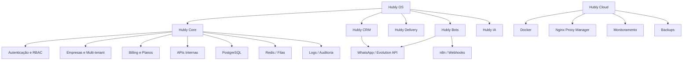

<picture>
  <source media="(prefers-color-scheme: dark)" srcset="https://capsule-render.vercel.app/api?type=waving&color=0:0f172a,45:f59e0b,100:f97316&height=230&section=header&text=Lucas%20Magista&fontSize=64&fontColor=ffffff&animation=fadeIn&fontAlignY=35&desc=SaaS%20%7C%20Automa%C3%A7%C3%B5es%20%7C%20CRM%20%7C%20IA%20%7C%20Infraestrutura&descAlignY=58&descSize=18">
  <source media="(prefers-color-scheme: light)" srcset="https://capsule-render.vercel.app/api?type=waving&color=0:f97316,55:f59e0b,100:0f172a&height=230&section=header&text=Lucas%20Magista&fontSize=64&fontColor=ffffff&animation=fadeIn&fontAlignY=35&desc=SaaS%20%7C%20Automa%C3%A7%C3%B5es%20%7C%20CRM%20%7C%20IA%20%7C%20Infraestrutura&descAlignY=58&descSize=18">
  
</picture>

<div align="center">

# 👋 Olá, eu sou o Lucas Magista

### Construindo produtos SaaS, automações e sistemas inteligentes para negócios reais.

Sou desenvolvedor e criador do ecossistema **Hubly**, com foco em soluções para atendimento, delivery, CRM, WhatsApp, automação, IA, infraestrutura própria e sistemas internos para empresas.

[](https://github.com/Lucasmagista)
[](https://www.linkedin.com/in/lucas-magista-67376a202/)
[](https://instagram.com/lucasmagista)
[](mailto:contatolucas.magista1@gmail.com)

</div>

---

## 🚀 Sobre mim

Atuo criando soluções que conectam **software, automação, infraestrutura e operação comercial**. Meu foco é transformar problemas reais de empresas em sistemas práticos, escaláveis e integrados.

Atualmente estudo e desenvolvo projetos envolvendo:

- plataformas SaaS multi-tenant;
- CRMs com atendimento integrado;
- automações para WhatsApp e marketplaces;
- bots, fluxos com n8n e integrações externas;
- infraestrutura com Docker, Portainer, Nginx Proxy Manager e servidores Linux;
- uso de IA em atendimento, produtividade, análise e sistemas internos;
- produtos digitais para empresas locais e operações comerciais.

---

## 🧠 Ecossistema Hubly

A **Hubly** é um ecossistema modular em construção para centralizar ferramentas de gestão, atendimento, automação, delivery, CRM, IA e infraestrutura para pequenos e médios negócios.

<table>
  <tr>
    <td width="50%">
      <h3>🧩 Hubly OS</h3>
      <p>Painel central para módulos, empresas, usuários, permissões, automações e integrações.</p>
    </td>
    <td width="50%">
      <h3>🍔 Hubly Delivery</h3>
      <p>Plataforma de pedidos, cardápio digital, carrinho, atendimento e integração com WhatsApp.</p>
    </td>
  </tr>
  <tr>
    <td width="50%">
      <h3>💬 Hubly CRM</h3>
      <p>Gestão de clientes, conversas, tickets, funis, histórico e atendimento omnichannel.</p>
    </td>
    <td width="50%">
      <h3>⚙️ Hubly Core</h3>
      <p>Base enterprise com multi-tenant, RBAC, billing, filas, eventos, APIs internas e auditoria.</p>
    </td>
  </tr>
  <tr>
    <td width="50%">
      <h3>🤖 Hubly Bots</h3>
      <p>Bots para WhatsApp, automações com n8n, envio de mensagens, lembretes e integrações.</p>
    </td>
    <td width="50%">
      <h3>☁️ Hubly Cloud</h3>
      <p>Ambiente próprio com Ubuntu Server, Docker, Portainer, proxy reverso, monitoramento e serviços internos.</p>
    </td>
  </tr>
</table>

---

## 🛠️ Stack principal

<div align="center">

### Front-end


### Back-end e APIs


### Banco de dados e filas


### Infraestrutura e DevOps


### Automação, WhatsApp e IA


</div>

---

## 🧩 Projetos e frentes de desenvolvimento

| Projeto | Objetivo | Status |
|---|---|---|
| **Hubly OS** | Centralizar módulos SaaS, empresas, permissões e automações | Em construção |
| **Hubly Delivery** | Criar uma plataforma de delivery integrada ao WhatsApp | Em construção |
| **Hubly CRM** | Atendimento, tickets, clientes, funis e histórico de conversas | Em construção |
| **Hubly Core** | Arquitetura multi-tenant, RBAC, billing, eventos e APIs internas | Planejamento avançado |
| **Hubly Cloud** | Servidor próprio com Docker, Portainer, proxy, banco e monitoramento | Ativo |
| **Bots WhatsApp** | Automações de atendimento, notificações, lembretes e integrações | Em evolução |
| **IA Operacional** | IA para atendimento, análise, produtividade e apoio a sistemas internos | Pesquisa e testes |

---

## 🎯 Foco atual

Estou concentrado em evoluir uma base sólida para produtos reais, com atenção especial em:

```txt
SaaS multi-tenant     → empresas, usuários, permissões e planos
CRM e atendimento     → tickets, conversas, funis e histórico
WhatsApp Automation   → Evolution API, bots, webhooks e filas
Infraestrutura Linux  → Docker, proxy reverso, monitoramento e backups
IA aplicada           → agentes, assistentes, análise e automações internas
Produtos locais       → soluções para empresas, delivery, lojas e operações reais
```

---

## 🧱 Arquitetura que estou estudando e aplicando


```mermaid
graph TD
    A[Hubly OS] --> B[Hubly Core]
    B --> C[Autenticação e RBAC]
    B --> D[Empresas e Multi-tenant]
    B --> E[Billing e Planos]
    B --> F[APIs Internas]

    A --> G[Hubly CRM]
    A --> H[Hubly Delivery]
    A --> I[Hubly Bots]
    A --> J[Hubly IA]

    G --> K[WhatsApp / Evolution API]
    I --> K
    I --> L[n8n / Webhooks]

    B --> M[PostgreSQL]
    B --> N[Redis / Filas]
    B --> O[Logs / Auditoria]

    P[Hubly Cloud] --> Q[Docker]
    P --> R[Nginx Proxy Manager]
    P --> S[Monitoramento]
    P --> T[Backups]
```

---

## 📊 GitHub Stats

<div align="center">
  
  
</div>

<div align="center">
  
</div>

---

## 🧭 Roadmap pessoal

- [ ] Consolidar a base do **Hubly Core**
- [ ] Finalizar módulos iniciais do **Hubly Delivery**
- [ ] Integrar **CRM + Evolution API + WhatsApp**
- [ ] Criar fluxos profissionais com **n8n**
- [ ] Padronizar infraestrutura Docker com backups e monitoramento
- [ ] Evoluir agentes de IA para atendimento, análise e produtividade
- [ ] Publicar documentação técnica dos principais módulos
- [ ] Abrir repositórios públicos selecionados do ecossistema Hubly

---

## 💡 Como penso produto

Gosto de construir software com visão prática:

- primeiro resolver um problema real;
- depois organizar a arquitetura;
- então automatizar processos repetitivos;
- por fim, transformar em produto reutilizável, escalável e vendável.

Meu objetivo é criar ferramentas que ajudem empresas a vender mais, atender melhor, operar com menos retrabalho e usar tecnologia de forma acessível.

---

## 📫 Contato

<div align="center">

[](https://github.com/Lucasmagista)
[](https://www.linkedin.com/in/lucas-magista-67376a202/)
[](https://instagram.com/lucasmagista)
[](mailto:lucas.magista1@gmail.com)

</div>

---

<div align="center">

### 🚀 Construindo tecnologia para negócios reais.


</div>
